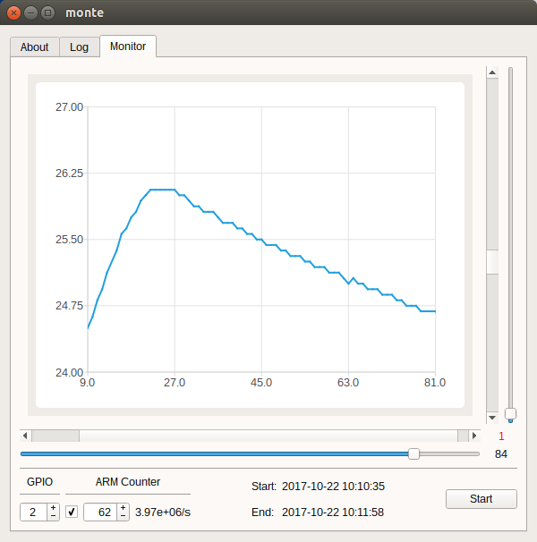

# Monte - Monitor Temperature

This projects provides a simple [Qt-based](https://en.wikipedia.org/wiki/Qt_(software)) graphical user interface to monitor the temperature. The thermometer is a DS18B20 circuit which is connected to a [Raspberry Pi](https://en.wikipedia.org/wiki/Raspberry_Pi).



The DS18B20's DQ pin can be connected to any of the Raspberry Pi's GPIO pins. This GPIO pin-number must be entered into the GPIO field. See the lower-left corner of the window. GPIO pin 2 is used in the screenshot.

This program requires a timer in order to communicate with the DS18B20 circuit. The Raspberry Pi's Free Running ARM Counter peripheral is used for this purpose. After booting the Pi, the Counter is disabled. You need to enable it by checking the box. You can leave the prescaler untouched (default 62).

The program records the temperature every second after the Start button is pressed. Above the Start button you see the number of attempts to read the temperature, and above that, the number of failed attempts (in red). If both numbers are the same then there is probably no DS18B20 circuit attached.

A slider and a scrollbar are provided for both axes to control the chart. The slider defines the visible size of the chart (clipping), while the scrollbar defines the current position.

## Installation

You can download a pre-build static binary and run it: [Release 1 (Beta)](https://github.com/ma16/monte/releases)

However, this is not recommended. Instead, you should build the program from source code. For further information read [INSTALL](INSTALL) and [RASPBIAN](RASPBIAN).

## Run the Program

The program was tested on a freshly installed [Raspbian image as of 7th Sep 2017](https://downloads.raspberrypi.org/raspbian/images/raspbian-2017-09-08/2017-09-07-raspbian-stretch.zip). 

The program expects that the ARM Counter is fed by a clock that runs at 250 MHz. However, the clock on the Pi-Zero and on the Pi-3 runs at 400 MHz and drops to 250 MHz when idle. You have to fix the clock to 250 MHz in /boot/config.txt with:
```
core_freq=250
```

The command line option '-v' gives you a diagnostic message. E.g.:

```
$ ./monte -v
Qt version: 5.7.1
Build time: Oct 19 2017 10:19:09
```

In order to work properly, the program needs to be executed with root permission (unless /dev/mem and /dev/vcio permit non-root access):
```
$ gksudo ./monte
```

## Troubleshooting

The program supports exactly one attached DS18B20 circuit. The program will fail if more than one circuit is attached.

The GPIO pin-number refers to the processor's numbering scheme. All recent Pis lead out the first 28 GPIO pins on the 40-pin header. They are often numbered as "BCM 0" to "BCM 27". See [Pinout](https://pinout.xyz).

The program will pull the given pin to Ground. Make sure there is a 4.8 kΩ resistor between VDD (3.3V) and the pin. If the pin is instead directly connected to VDD, the Raspberry Pi will get damaged!

The DS18B20 has to be wired according to the [datasheet](http://datasheets.maximintegrated.com/en/ds/DS18B20.pdf). For example:

* Connect the DS18B20's GND pin to any of the GND pins on the Raspberry Pi's pin-header.
* Connect the DS18B20's DQ pin to any of the GPIO pins on the Raspberry Pi's pin-header.
* Connect the DS18B20's VDD pin to any of the 3.3V pins on the Raspberry Pi's pin-header.
* Connect a 4.8 kΩ resistor between VDD and DQ.

The program will fail if the given GPIO pin is already used. For example, Raspbian supports several drivers that seize certain GPIO pins. See [Raspberry Device Tree](https://www.raspberrypi.org/documentation/configuration/device-tree.md).

The program uses a bit-banged implementation. (It does not use Raspbian's 1-Wire [w1-gpio](https://www.raspberrypi.org/forums/viewtopic.php?f=44&t=65137) driver.) There is no real-time guarantee. However, deferred communication is detected and retried.

If there is a problem in the communication between Raspberry Pi and DS18B20, the program will:

* Retry 10 times on deferred communication.
* Retry twice if a CRC failure occurs.
* Retry twice if no Presence Pulse is detected.

After that, or if another problem occurs, no more attempts are made to read the temperature. The number of failed attempts is incremented (red). The program proceeds at the next interval after one second. Successful and failed attempts are also recorded in the Log Window of the program.
